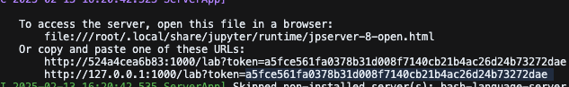

## Welcome to the docker tutorial.

First, we will connect to the DSI servers.

``` shell
ssh ubuntu@landmark-t-01.dsi.ic.ac.uk
su -l ah3918
```

You should now be in your home directory. Next, we're going to make sure docker daemon is running.

``` {.shell .sh}
docker run hello-world
```

We will also login to our docker.

``` shell
docker login
```

Next, we're going to clone the essential functions repository.

### Setting up

```         
git clone https://github.com/johnsonlab-ic/essential_functions/
cd essential_functions
```

Then, we're going to build our first image! I've loaded a very simple image, in `Docker_images/Dockerfile.tutorial.`

```         
docker build -t my_tutorial_image:latest -f Docker_images/Dockerfile.tutorial .
```

Where;

-   `-t tutorial_image:latest` tags the image with the name `tutorial_image` and the tag `latest`.

-   `-f Dockerfile.tutorial` specifies the Dockerfile to use.

-   `.` specifies the current directory as the build context.

You have now build a Docker "image", which is a lightweight, standalone executable package that contains everything you've loaded the instructions with.

## Running the containers

To make use of this Docker image, you need to run a Docker **container**. A **container** is a runtime "instance" of a docker image - which again, uses the image and loads all necessary packages. The "instance" is an important distinction; because you can run multiple containers from the same image. The important part of a container is that it is **isolated from the host system**, meaning you can do whatever you want within them without fear of breaking anything. It also means that it's lightweight and **completely** **configurable**. Now, you can run your image!

``` shell
docker run -it --name tutorial_container my_tutorial_image:latest
```

This will open up an interactive session. You are now "inside" the container. Anything done here will remain in the container. To exit the container, you can use "`exit`" . This "stops" the container, and you would have to re-start it and re-attach it.

`docker ps` will show active containers

`docker ps -a` will show active and stopped containers

```         
docker start -i alex_container
```

```         
```

### Mounting the file system

One of the "drawbacks" of a container is that it is in fact, completely isolated to everything; it is it's own system, with its own packages, filesystem, config files etc. It doesn't know about anything "outside" of it. Unless, you specifically mount directories in it.

First, we'll create a directory in your home directory, and add some textfiles. Make sure you are no longer inside the container!

``` shell
cd $home
mkdir -p tutorial_dir
echo "This is file 1" > tutorial_dir/file1.txt
echo "This is file 2" > tutorial_dir/file2.txt
```

Then, we'll restart the container. For security reasons, docker does not allow you to mount a folder on an already "created" container. So we'll remove/delete the old container and start again.

``` shell
docker stop alex_container
docker rm alex_container
docker run -it --name alex_container -v $(pwd)/tutorial_dir:/app/tutorial_dir my_tutorial_image:latest
```

```         
cd ../
echo "This is file 3" > tutorial_dir/file3.txt
```

### Bonus - Jupyter server within a docker container

You can even create a jupyter server within a docker container that you can connect to externally! I have created a file called Dockerfile.tutorial_jupyter which contains some instructions to set this up.

To run this you need to.

1.  Build the image

```         
cd ${home}
cd essential_functions/
git pull
docker build -t jupyter_tutorial:latest -f Docker_images/Dockerfile.tutorial_jupyter .
```

2.  Run the container

make sure you configure your container port (the port you will define inside the container) and your host port (this is the DSI port). I will name mine

host_port=1234

container_port=1000

```         
cd $home
docker run -it -p 1234:1000 -v $(pwd)/tutorial_dir:/app/tutorial_dir --name jupyter_alex jupyter_tutorial:latest
```

3.  Then, inside the container, run this line;

```         
jupyter lab --ip=0.0.0.0 --port=<container_port> --no-browser --allow-root
```

Where `<container_port>` is the previously defined port, in my case 1000.

```         
jupyter lab --ip=0.0.0.0 --port=1000 --no-browser --allow-root
```

5.  In your **local machine (NOT DSI)**, you need to create an SSH tunnel to connect to it.

```         
ssh -f -N -L <local_port>:localhost:<host_port> ubuntu@landmark-t-01.dsi.ic.ac.uk
```

To keep things simple, I will name `<local_port>` = 1234 (note, this could just as easily be 1400 or any other 4 digit number). \<host_port\> is already 1234, as defined earlier.

```         
ssh -f -N -L 1234:localhost:1234 ubuntu@landmark-t-01.dsi.ic.ac.uk
```

Then, if you go into a browser, you can just go to <http://localhost:1234> or whatever you named the port. It will ask for a token; inside your jupyter server, there should be a token mentioned there which you can copy paste.



You can even do this within VScode!

Open up a new notebook (for example, tutorial.ipynb), select kernel \> existing jupyter server \> enter "<http://localhost:1234> " \> enter token and you should now have a DSI-connected jupyter server.